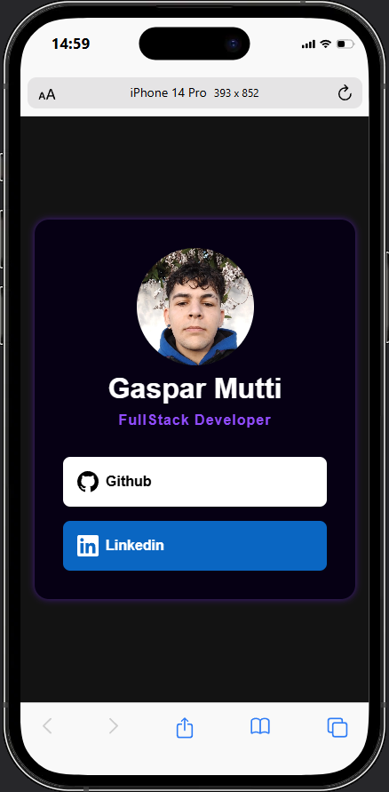
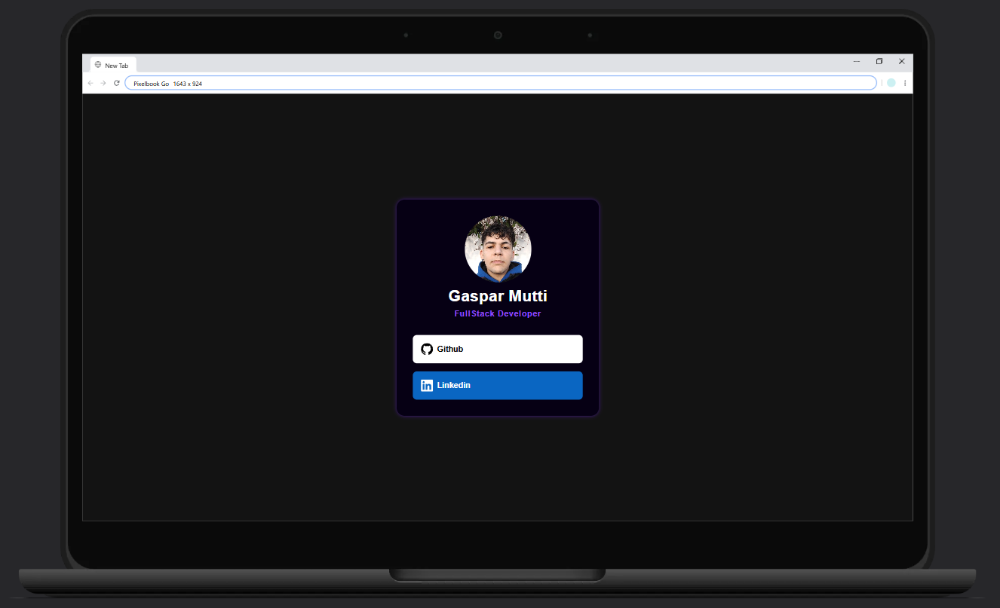

# #2 SOCIAL MEDIA LINKS

Responsive layout with links to connect social profiles, section builded with HTML, CSS and wearing focus on seo, performance and accessibility.

This is a solution to the [Social links profile challenge on Frontend Mentor](https://www.frontendmentor.io/challenges/social-links-profile-UG32l9m6dQ). Frontend Mentor challenges help you improve your coding skills by building realistic projects. 

## Overview

### The challenge

Users should be able to:

- See hover and focus states for all interactive elements on the page
### Screenshots

### Links

- Solution URL: [Github](https://github.com/GasparMutti/social-media-links)
- Live Site URL: [Github](https://gasparmutti.github.io/social-media-links)

## My process

### Built with

- Semantic HTML5 markup
- Modern CSS
- Mobile-first workflow

## Author

- Github - [Gaspar Mutti](https://github.com/GasparMutti)
- Frontend Mentor - [@gasparmutti](https://www.frontendmentor.io/profile/gasparmutti)